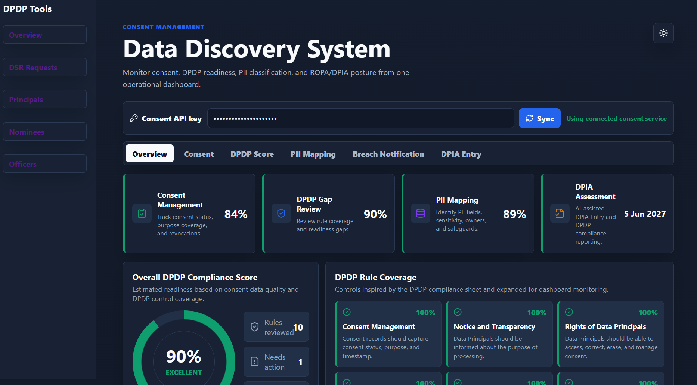
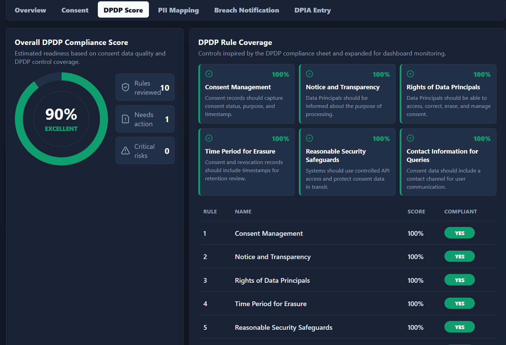
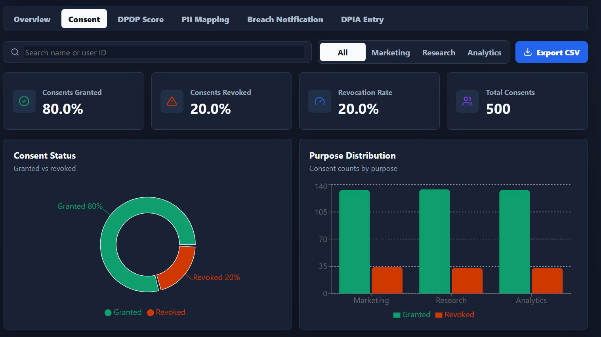
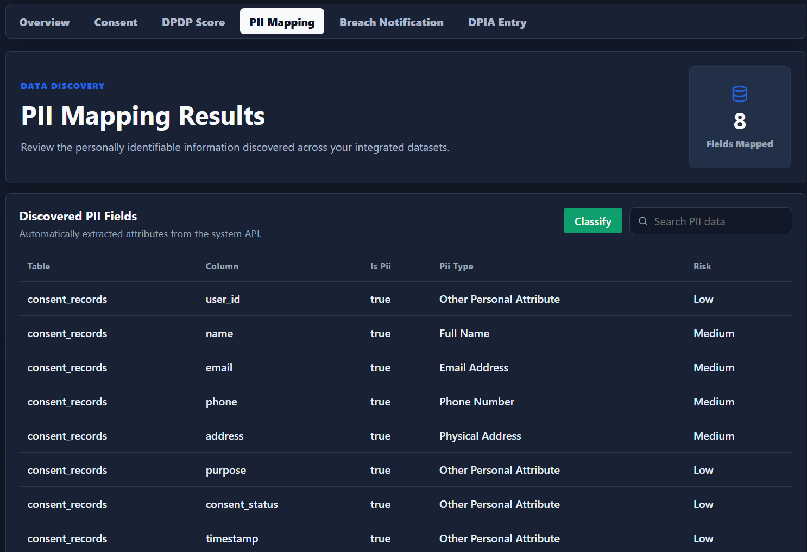
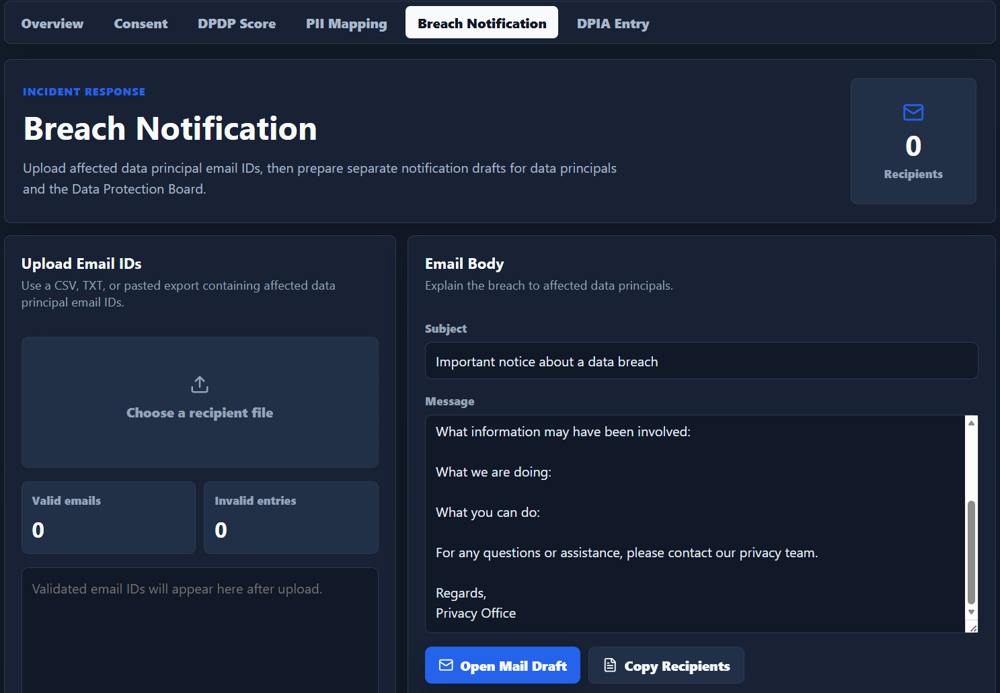

<!-- _class: cover nologo -->

  

    
DPDP Compliance Series

    <h1>Data Discovery & Consent Management System</h1>
    <h2 style="font-size: 20px; color: var(--dt-gray); font-weight: 500; margin-top: 4px;">DPDP Compliance Dashboard (DDS-CMS)</h2>
    
Project Overview, Dashboard Workflow & Future Multi-Tenant Architecture

  

  

    
  

<!--
Speaker Notes:
Good morning/afternoon, everyone. Today I am presenting our project: the Data Discovery & Consent Management System, or DDS-CMS. 
This is a comprehensive DPDP Compliance Dashboard designed to bridge the gap between regulatory requirements and technical operations.
During this presentation, I'll walk you through our project overview, the backend workflows, our modules, our analytical capabilities, and finally, our future expansion plans for multi-tenant support.
-->

---

# Project Overview

  

    

      <h3>Objective</h3>
      

        Develop a centralized, automated dashboard to assist organizations in monitoring, assessing, and improving compliance under India's Digital Personal Data Protection (DPDP) Act.
      

    

    

      <h3>Key Features</h3>
      <ul style="margin: 4px 0; padding-left: 20px; font-size: 13px;">
        <li style="margin-bottom: 6px;"><strong>Consent Management</strong>: Centralized consent capture & revocation logs.</li>
        <li style="margin-bottom: 6px;"><strong>DPDP Assessment</strong>: Automated readiness scorecard based on rules.</li>
        <li style="margin-bottom: 6px;"><strong>PII Discovery</strong>: Automated PII detection and classification.</li>
        <li style="margin-bottom: 6px;"><strong>ROPA & DPIA</strong>: Record of processing activities and risk management.</li>
        <li style="margin-bottom: 6px;"><strong>AI Privacy Assistant</strong>: Automated reporting & compliance guidance.</li>
      </ul>
    

  

  

    

      <h3>Technology Stack</h3>
      <ul style="margin: 4px 0; padding-left: 20px; font-size: 13px;">
        <li style="margin-bottom: 6px;"><strong>Frontend</strong>: React (Interactive Dashboard)</li>
        <li style="margin-bottom: 6px;"><strong>Backend</strong>: Node.js + Express (REST APIs Gateway)</li>
        <li style="margin-bottom: 6px;"><strong>AI Engine</strong>: Groq LLM (Contextual Privacy Intelligence)</li>
        <li style="margin-bottom: 6px;"><strong>Consent Storage</strong>: Consent Manager APIs & Postgres DB</li>
      </ul>
    

    <h3 style="font-size: 15px; margin-top: 10px;">System Architecture</h3>
    

      
User

      
➔

      
React UI

      
➔

      
Express API

      
➔

      
Consent Mgr

      
➔

      
Consent DB

    

  

DDS-CMS | DPDP Compliance Dashboard

<!--
Speaker Notes:
This slide highlights the project overview of DDS-CMS.
The main objective is to provide a single control plane for compliance teams to monitor how customer data is processed.
Our dashboard covers five key functional areas: Consent management, DPDP assessments, PII mapping, ROPA/DPIA, and an AI privacy assistant.
We built this using React for the interface, Node.js and Express for the API, Groq LLM for AI reporting, and a robust Consent Manager system.
The diagram below shows the flow: a user interacts with the React UI, which contacts the Express API, which communicates with the Consent Manager gateway to record or query consent states in the database.
-->

---

# DDS-CMS Workflow

  

    

      

        
User

        
➔

        
Enter API Key

        
➔

        
Sync Consent

      

      
▼

      
DDS-CMS Core Dashboard

      
▼

      

        
Consent Analytics

        
DPDP Compliance

        
PII Mapping

        
ROPA & DPIA

      

      
▼

      
Export Compliance Reports

    

  

  

    

      <h3 style="font-size: 15px; margin-bottom: 4px;">Operational Phases</h3>
      <ul style="margin: 2px 0; padding-left: 16px; font-size: 12px; line-height: 1.4;">
        <li style="margin-bottom: 4px;"><strong>API Connection</strong>: Secure client environment pairing.</li>
        <li style="margin-bottom: 4px;"><strong>Data Sync</strong>: Background consent registry synchronization.</li>
        <li style="margin-bottom: 4px;"><strong>Compliance Assessment</strong>: Real-time DPDP score updates.</li>
        <li style="margin-bottom: 0px;"><strong>Continuous Alerts</strong>: Immediate visibility of processing gaps.</li>
      </ul>
    

    

      
      
      
      
      
    

  

DDS-CMS | DPDP Compliance Dashboard

<!--
Speaker Notes:
Here is the end-to-end user workflow of the DDS-CMS.
The process starts when a user logs in and securely registers their environment by entering their API key.
This instantly triggers data synchronization, pulling consent log data into the central compliance engine.
Once ingested, the system feeds it into the core modules of our dashboard: Consent Analytics, DPDP Compliance rules, PII discovery, and ROPA/DPIA assessments.
Finally, the compliance officer can download complete reports and audits to prove compliance to regulators.
-->

---

# Compliance Dashboard Modules

  

    

      
<i class="fa-solid fa-chart-line"></i>

      <h3 style="font-size: 14px;">Overview</h3>
    

    

      Executive summary of compliance readiness. Displays core KPIs, recent data sync metrics, and overall rule coverage.
    

  

  

    

      
<i class="fa-solid fa-gauge-high"></i>

      <h3 style="font-size: 14px;">DPDP Score</h3>
    

    

      Real-time compliance rating calculated dynamically based on implemented system controls.
    

  

  

    

      
<i class="fa-solid fa-square-check"></i>

      <h3 style="font-size: 14px;">Consent</h3>
    

    

      Monitor active, expired, and revoked consents. View analytics and export raw records to CSV for auditors.
    

  

  

    

      
<i class="fa-solid fa-database"></i>

      <h3 style="font-size: 14px;">PII Mapping</h3>
    

    

      Scan database schemas and API payloads to identify and classify sensitive customer data automatically.
    

  

  

    

      
<i class="fa-solid fa-shield-halved"></i>

      <h3 style="font-size: 14px;">ROPA & DPIA</h3>
    

    

      Maintain the Record of Processing Activities and perform automated Data Protection Impact Assessments.
    

  

DDS-CMS | DPDP Compliance Dashboard

<!--
Speaker Notes:
This slide details the layout of our Compliance Dashboard modules, which we've designed in a standard bento-grid structure.
The five modules are:
1. Overview: The main landing screen summarizing general readiness.
2. DPDP Score: Our calculated index showing where we stand on compliance rules.
3. Consent: The dashboard section tracking granted and revoked permissions.
4. PII Mapping: The classification module that highlights high-risk columns.
5. ROPA & DPIA: The record-keeping and assessment panel.
Let's look at how we calculate these scores in the next slide.
-->

---

# Compliance Analytics

  

    

      <h3><i class="fa-solid fa-chart-simple"></i> Consent KPIs</h3>
      <ul style="margin: 4px 0; padding-left: 20px; font-size: 13px;">
        <li style="margin-bottom: 4px;"><strong>Total Consents</strong>: Aggregated count of registered user preferences.</li>
        <li style="margin-bottom: 4px;"><strong>Granted vs. Revoked</strong>: Real-time status breakdown.</li>
        <li style="margin-bottom: 4px;"><strong>Revocation Rate</strong>: Key indicator of user opt-out trends.</li>
      </ul>
    

    

      <h3><i class="fa-solid fa-scale-balanced"></i> DPDP Readiness</h3>
      
The compliance engine continuously evaluates the following pillars:

      

        

          • Consent Operations 
          • Notice & Transparency 
          • Data Principal Rights
        

        

          • Security Safeguards 
          • Data Minimization 
          • Breach Readiness
        

      

    

  

  

    <h3>DPDP Score Calculation</h3>
    
The system evaluates individual rules and aggregates them via a weighted score model to establish the final DPDP Compliance score.

    

      
Compliance Rules

      
▼

      
Individual Scores

      
▼

      
Weighted Calculation

      
▼

      
Final DPDP Score

    

  

DDS-CMS | DPDP Compliance Dashboard

<!--
Speaker Notes:
This slide describes our compliance analytics.
We measure compliance status using two methods: Consent KPIs and the DPDP readiness framework.
Consent KPIs include Total Consents, active ratios, and the revocation rate.
DPDP readiness reviews six critical compliance areas, including notice transparency, data principal rights, security safeguards, minimization, and breach response.
Instead of arbitrary ratings, the overall DPDP Score is calculated using a rule engine: individual checklist rules are scored, weighted based on regulatory impact, and aggregated into a single verifiable compliance score.
-->

---

# PII Discovery & Privacy Intelligence

  

    

      <h3><i class="fa-solid fa-user-lock"></i> Automated Discovery</h3>
      
Automatically scans database structures and identifies PII fields:

      

        Name
        Email
        Phone
        Address
        User ID
      

      
Attributes are automatically assigned a Category, Risk Level (High/Med/Low), Owner, and Protection Method (e.g. Encrypted/Masked).

    

    

      <h3><i class="fa-solid fa-robot"></i> AI Privacy Assistant</h3>
      <ul style="margin: 4px 0; padding-left: 18px; font-size: 13px;">
        <li>Leverages discovered schema details to identify compliance gaps.</li>
        <li>Guides developers and compliance teams through automated DPIAs.</li>
        <li>Drafts custom incident response templates and audit documents.</li>
      </ul>
    

  

  

    <h3>Privacy Intelligence Pipeline</h3>
    

      
Consent Data

      
▼

      
PII Classification

      
▼

      
Risk Assessment

      
▼

      
AI Assistant Guidance

      
▼

      
Compliance Report

    

  

DDS-CMS | DPDP Compliance Dashboard

<!--
Speaker Notes:
This slide covers PII Mapping and our AI Assistant.
A major challenge is knowing where sensitive data lives. DDS-CMS automatically runs scanning scripts on connected database tables to detect PII fields.
Once fields like Name, Email, or Phone are discovered, they are classified.
To assist compliance teams, our AI assistant consumes this schema metadata. Instead of legal teams manually reviewing tables, the AI evaluates processing actions, helps complete the Data Protection Impact Assessment (DPIA), and writes the compliance reports automatically.
-->

---

# Backend & API Workflow

  

    <h3>System Communication</h3>
    

      
React Dashboard

      
▼

      
REST APIs Gateway

      
▼

      
Express Backend

      
▼

      
Consent Manager Engine

      
▼

      
Consent Database

    

  

  

    

      <h3>Backend Core Endpoints</h3>
      <ul style="margin: 4px 0; padding-left: 20px; font-size: 13px;">
        <li style="margin-bottom: 6px;"><strong>Consent Retrieval</strong>: Queries and validates user options in real-time.</li>
        <li style="margin-bottom: 6px;"><strong>PII Classification</strong>: Runs classification routines on metadata.</li>
        <li style="margin-bottom: 6px;"><strong>DPDP Score Engine</strong>: Computes compliance stats.</li>
        <li style="margin-bottom: 6px;"><strong>Risk Assessment API</strong>: Evaluates vulnerabilities in data flow.</li>
      </ul>
    

    

      <h3>Architecture Design Goals</h3>
      <ul style="margin: 4px 0; padding-left: 20px; font-size: 13px;">
        <li><strong>Secure API Communication</strong>: Token-based endpoints.</li>
        <li><strong>Modular Infrastructure</strong>: Independent components ensure easy updates.</li>
        <li><strong>Scalable Architecture</strong>: Optimized databases and low latency.</li>
      </ul>
    

  

DDS-CMS | DPDP Compliance Dashboard

<!--
Speaker Notes:
This slide explains our backend and API architecture.
The frontend React dashboard communicates with Node.js and Express backend via REST APIs.
The backend handles consent status requests, runs PII classification, executes DPDP score evaluations, and handles risk metrics.
We emphasized three key architectural goals: securing all API communication using tokens, utilizing a modular service layout, and structuring the database for minimal latency.
-->

---

# Future Architecture – Approach A

  <h2 style="font-size: 18px; color: var(--dt-gray); font-weight: 500; margin: 0 0 4px 0;">Centralized Multi-Tenant Compliance Portal</h2>
  
Single Compliance Portal for Multiple Organizations

  

    

      <h3 style="font-size: 13px; margin-bottom: 4px; display: flex; align-items: center; gap: 6px;"><i class="fa-solid fa-circle-info" style="color: var(--dt-red);"></i> How it Works</h3>
      

        

          <i class="fa-solid fa-chevron-right" style="font-size: 8px; color: var(--dt-red); margin-top: 4px; flex-shrink: 0;"></i>
          A single centralized compliance portal serves multiple organizations.
        

        

          <i class="fa-solid fa-chevron-right" style="font-size: 8px; color: var(--dt-red); margin-top: 4px; flex-shrink: 0;"></i>
          The backend registry maintains organization configs and API endpoints.
        

        

          <i class="fa-solid fa-chevron-right" style="font-size: 8px; color: var(--dt-red); margin-top: 4px; flex-shrink: 0;"></i>
          Each organization backend secures endpoints via auth mapping.
        

        

          <i class="fa-solid fa-chevron-right" style="font-size: 8px; color: var(--dt-red); margin-top: 4px; flex-shrink: 0;"></i>
          Upon user login, the portal gateway retrieves organization API keys.
        

        

          <i class="fa-solid fa-chevron-right" style="font-size: 8px; color: var(--dt-red); margin-top: 4px; flex-shrink: 0;"></i>
          Fetches Consent and PII data from the company's remote server.
        

        

          <i class="fa-solid fa-chevron-right" style="font-size: 8px; color: var(--dt-red); margin-top: 4px; flex-shrink: 0;"></i>
          The central DPDP compliance engine calculates score and metrics dynamically.
        

      

    

    

      

        <h3 style="font-size: 12px; margin-bottom: 4px; color: var(--dt-green); display: flex; align-items: center; gap: 4px;"><i class="fa-solid fa-thumbs-up"></i> Advantages</h3>
        

          
<i class="fa-solid fa-check" style="color: var(--dt-green); font-size: 10px;"></i> Single centralized platform

          
<i class="fa-solid fa-check" style="color: var(--dt-green); font-size: 10px;"></i> Easy onboarding

          
<i class="fa-solid fa-check" style="color: var(--dt-green); font-size: 10px;"></i> Common dashboard

          
<i class="fa-solid fa-check" style="color: var(--dt-green); font-size: 10px;"></i> Centralized administration

        

      

      

        <h3 style="font-size: 12px; margin-bottom: 4px; color: var(--dt-red); display: flex; align-items: center; gap: 4px;"><i class="fa-solid fa-triangle-exclamation"></i> Limitations</h3>
        

          
<i class="fa-solid fa-xmark" style="color: var(--dt-red); font-size: 10px;"></i> Separate login portal

          
<i class="fa-solid fa-xmark" style="color: var(--dt-red); font-size: 10px;"></i> Registry maintenance

          
<i class="fa-solid fa-xmark" style="color: var(--dt-red); font-size: 10px;"></i> Additional isolation effort

        

    

  

  

    <h3 style="font-size: 14px; margin-bottom: 8px; text-align: center;"><i class="fa-solid fa-network-wired" style="color: var(--dt-red); margin-right: 4px;"></i> Architecture Flow</h3>
    

Company Admin

▼

Login to Portal

▼

Express Gateway

➔

Registry DB

▼

Load Config

▼

Call Company APIs

➔

Fetch Consent/PII

▼

DPDP Engine

▼

Compliance Portal

  

DDS-CMS | DPDP Compliance Dashboard

<!--
Speaker Notes:
Here we present Future Architecture Approach A: the Centralized Multi-Tenant Compliance Portal.
Under this model, a single centralized compliance platform serves multiple distinct tenant organizations. 
When a company administrator logs in, our Express gateway resolves their identity against an Organization Registry database, loads their specific API configuration, and calls their backend to fetch consent and PII data.
The data is then processed by our centralized DPDP compliance engine to render a dashboard within our portal.
While onboarding and administrative control are centralized and straightforward, this model requires a separate login portal for tenants and places the responsibility of data isolation and registry database maintenance entirely on our platform.
-->

---

# Future Architecture – Approach B

  <h2 style="font-size: 18px; color: var(--dt-gray); font-weight: 500; margin: 0 0 4px 0;">API-Driven Embedded CMS Architecture (Recommended)</h2>
  
Compliance Dashboard Embedded Inside Company CMS

  

    

      <h3 style="font-size: 13px; margin-bottom: 4px; display: flex; align-items: center; gap: 6px;"><i class="fa-solid fa-circle-info" style="color: var(--dt-red);"></i> How it Works</h3>
      

        

          <i class="fa-solid fa-chevron-right" style="font-size: 8px; color: var(--dt-red); margin-top: 4px; flex-shrink: 0;"></i>
          Each company manages its own API key from its CMS settings directly.
        

        

          <i class="fa-solid fa-chevron-right" style="font-size: 8px; color: var(--dt-red); margin-top: 4px; flex-shrink: 0;"></i>
          The compliance dashboard is embedded directly into the company's CMS.
        

        

          <i class="fa-solid fa-chevron-right" style="font-size: 8px; color: var(--dt-red); margin-top: 4px; flex-shrink: 0;"></i>
          The CMS sends compliance data and API key to our Express backend.
        

        

          <i class="fa-solid fa-chevron-right" style="font-size: 8px; color: var(--dt-red); margin-top: 4px; flex-shrink: 0;"></i>
          Our backend performs all DPDP calculations (score, PII, risk).
        

        

          <i class="fa-solid fa-chevron-right" style="font-size: 8px; color: var(--dt-red); margin-top: 4px; flex-shrink: 0;"></i>
          The backend returns standardized JSON compliance datasets.
        

        

          <i class="fa-solid fa-chevron-right" style="font-size: 8px; color: var(--dt-red); margin-top: 4px; flex-shrink: 0;"></i>
          The CMS renders the dashboard interface inside its own native interface.
        

      

    

    

      

        <h3 style="font-size: 12px; margin-bottom: 4px; color: var(--dt-green); display: flex; align-items: center; gap: 4px;"><i class="fa-solid fa-thumbs-up"></i> Advantages</h3>
        

          
<i class="fa-solid fa-check" style="color: var(--dt-green); font-size: 10px;"></i> Single Sign-On (SSO)

          
<i class="fa-solid fa-check" style="color: var(--dt-green); font-size: 10px;"></i> Better user experience

          
<i class="fa-solid fa-check" style="color: var(--dt-green); font-size: 10px;"></i> Better data isolation

          
<i class="fa-solid fa-check" style="color: var(--dt-green); font-size: 10px;"></i> Stateless backend

          
<i class="fa-solid fa-check" style="color: var(--dt-green); font-size: 10px;"></i> Easy horizontal scaling

        

      

      

        <h3 style="font-size: 12px; margin-bottom: 4px; color: var(--dt-red); display: flex; align-items: center; gap: 4px;"><i class="fa-solid fa-triangle-exclamation"></i> Limitations</h3>
        

          
<i class="fa-solid fa-xmark" style="color: var(--dt-red); font-size: 10px;"></i> Requires CMS integration

          
<i class="fa-solid fa-xmark" style="color: var(--dt-red); font-size: 10px;"></i> Frontend embed effort

          
<i class="fa-solid fa-xmark" style="color: var(--dt-red); font-size: 10px;"></i> CMS must integrate API

        

      

    

  

  

    <h3 style="font-size: 14px; margin-bottom: 8px; text-align: center;"><i class="fa-solid fa-network-wired" style="color: var(--dt-red); margin-right: 4px;"></i> Embedded Flow</h3>
    

Company Admin

▼

Company CMS

▼

Compliance Module

➔

Generate API Key

▼

Call /api/compliance/...

▼

Express Engine

➔

DPDP Score / PII / Risk

▼

Return Std JSON

▼

Embedded Dashboard

  

DDS-CMS | DPDP Compliance Dashboard

<!--
Speaker Notes:
Approach B represents an API-driven embedded CMS architecture.
Instead of sending users to our centralized portal, the compliance dashboard is embedded directly into the company's own CMS.
Each company manages their own compliance module settings and API keys inside their local CMS.
The CMS then sends consent and PII compliance data to our backend, which performs calculations statelessly and returns standardized JSON.
The CMS renders the dashboard locally within its own interface.
This provides a superior user experience with single sign-on, ensures natural data isolation, simplifies our backend to be stateless, and allows easy horizontal scaling. However, it requires frontend embedding effort and custom integration by each CMS.
-->

---

# Architecture Comparison & Recommendation

<table style="width: 100%; border-collapse: collapse; font-size: 10px; margin: 4px 0;">
  <thead>
    <tr style="background: var(--dt-red); color: white;">
      <th style="padding: 5px 8px; font-weight: 700; text-align: left; text-transform: uppercase; letter-spacing: 0.5px;">Criteria</th>
      <th style="padding: 5px 8px; font-weight: 700; text-align: left; text-transform: uppercase; letter-spacing: 0.5px;">Approach A: Centralized Portal</th>
      <th style="padding: 5px 8px; font-weight: 700; text-align: left; text-transform: uppercase; letter-spacing: 0.5px; background: var(--dt-red-light);">Approach B: Embedded CMS (Recommended)</th>
    </tr>
  </thead>
  <tbody>
    <tr>
      <td style="padding: 3px 8px; font-weight: 600; border-bottom: 1px solid var(--dt-border);">Portal Location</td>
      <td style="padding: 3px 8px; border-bottom: 1px solid var(--dt-border);">Centralized SaaS Portal</td>
      <td style="padding: 3px 8px; border-bottom: 1px solid var(--dt-border); font-weight: 600; background: #fff8f8;">Embedded inside Company CMS</td>
    </tr>
    <tr>
      <td style="padding: 3px 8px; font-weight: 600; border-bottom: 1px solid var(--dt-border);">Dashboard</td>
      <td style="padding: 3px 8px; border-bottom: 1px solid var(--dt-border);">Central Common Dashboard</td>
      <td style="padding: 3px 8px; border-bottom: 1px solid var(--dt-border); font-weight: 600; background: #fff8f8;">Native Embedded CMS Interface</td>
    </tr>
    <tr>
      <td style="padding: 3px 8px; font-weight: 600; border-bottom: 1px solid var(--dt-border);">Authentication</td>
      <td style="padding: 3px 8px; border-bottom: 1px solid var(--dt-border);">Separate Portal Login</td>
      <td style="padding: 3px 8px; border-bottom: 1px solid var(--dt-border); font-weight: 600; background: #fff8f8;">Single Sign-On (SSO) via CMS</td>
    </tr>
    <tr>
      <td style="padding: 3px 8px; font-weight: 600; border-bottom: 1px solid var(--dt-border);">API Key Management</td>
      <td style="padding: 3px 8px; border-bottom: 1px solid var(--dt-border);">Central Registry Database</td>
      <td style="padding: 3px 8px; border-bottom: 1px solid var(--dt-border); font-weight: 600; background: #fff8f8;">Managed in local CMS settings</td>
    </tr>
    <tr>
      <td style="padding: 3px 8px; font-weight: 600; border-bottom: 1px solid var(--dt-border);">Backend Storage</td>
      <td style="padding: 3px 8px; border-bottom: 1px solid var(--dt-border);">Persistent Registry Config DB</td>
      <td style="padding: 3px 8px; border-bottom: 1px solid var(--dt-border); font-weight: 600; background: #fff8f8;">Stateless (No Tenant Registry DB)</td>
    </tr>
    <tr>
      <td style="padding: 3px 8px; font-weight: 600; border-bottom: 1px solid var(--dt-border);">Data Isolation</td>
      <td style="padding: 3px 8px; border-bottom: 1px solid var(--dt-border);">Logical Isolation on Platform</td>
      <td style="padding: 3px 8px; border-bottom: 1px solid var(--dt-border); font-weight: 600; background: #fff8f8;">Strict Natural Tenant Isolation</td>
    </tr>
    <tr>
      <td style="padding: 3px 8px; font-weight: 600; border-bottom: 1px solid var(--dt-border);">Scalability</td>
      <td style="padding: 3px 8px; border-bottom: 1px solid var(--dt-border);">Moderate (Central Routing Overhead)</td>
      <td style="padding: 3px 8px; border-bottom: 1px solid var(--dt-border); font-weight: 600; background: #fff8f8;">High (Stateless Backend Scaling)</td>
    </tr>
    <tr>
      <td style="padding: 3px 8px; font-weight: 600; border-bottom: 1px solid var(--dt-border);">User Experience</td>
      <td style="padding: 3px 8px; border-bottom: 1px solid var(--dt-border);">Separate Dashboard Login</td>
      <td style="padding: 3px 8px; border-bottom: 1px solid var(--dt-border); font-weight: 600; background: #fff8f8;">Seamless Integrated CMS Experience</td>
    </tr>
    <tr>
      <td style="padding: 3px 8px; font-weight: 600; border-bottom: 1px solid var(--dt-border);">Backend Responsibility</td>
      <td style="padding: 3px 8px; border-bottom: 1px solid var(--dt-border);">High (Gateway, Routing & Mappings)</td>
      <td style="padding: 3px 8px; border-bottom: 1px solid var(--dt-border); font-weight: 600; background: #fff8f8;">Low (Stateless Calculation APIs)</td>
    </tr>
    <tr>
      <td style="padding: 3px 8px; font-weight: 600; border-bottom: 1px solid var(--dt-border);">Recommendation</td>
      <td style="padding: 3px 8px; border-bottom: 1px solid var(--dt-border);">Centralized SaaS Platform Deployments</td>
      <td style="padding: 3px 8px; border-bottom: 1px solid var(--dt-border); font-weight: 600; color: var(--dt-green); background: #fff8f8;"><strong>Recommended Approach (SSO & Isolation)</strong></td>
    </tr>
  </tbody>
</table>

  Both architectures achieve the same compliance goals using different deployment models. Approach A is suitable for a centralized SaaS compliance platform where organizations access a common portal. Approach B integrates directly into an organization's existing CMS, providing a seamless single-login experience, natural tenant isolation, and a lightweight stateless backend. Both approaches will be presented to stakeholders, and the final architecture will be selected based on project requirements.

DDS-CMS | DPDP Compliance Dashboard

<!--
Speaker Notes:
To compare both approaches, we evaluate them across key architectural criteria.
Approach A provides a centralized, SaaS-like portal that is quick to onboard if companies do not want to modify their CMS. However, it introduces separate login flows and database registry overhead.
Approach B offers a seamless native CMS experience, uses single sign-on, and ensures strict data isolation by keeping data on the client side, while keeping our backend stateless and highly scalable.
Both approaches achieve our compliance goals. We will present both to stakeholders to make a final selection based on the specific deployment requirements of our customers.
-->
ke a final selection based on the specific deployment requirements of our customers.
-->

